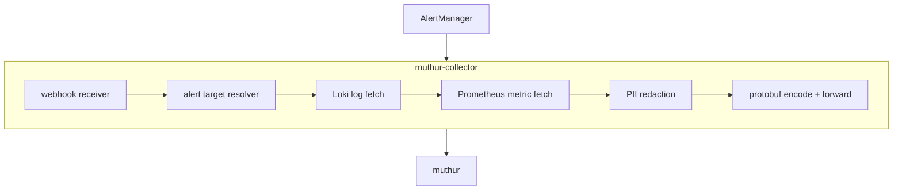

<p align="center">
    
</p>

# muthur-collector

Lightweight Kubernetes alert collector agent. Part of the [muthur](https://github.com/VojtechPastyrik) monitoring system.

Receives AlertManager webhooks, resolves alert targets via the K8s API, fetches logs from Loki and metrics from Prometheus, redacts PII and credentials, and forwards enriched protobuf payloads to [muthur](https://github.com/VojtechPastyrik/muthur).

<sub>**Keywords:** Kubernetes alert enrichment · AlertManager webhook collector · Loki log + Prometheus metric enrichment · PII / credential redaction · AIOps · SRE · observability · self-hosted.</sub>



## Prerequisites

- Go 1.26+
- protoc + protoc-gen-go
- Helm 3

## Quick start

```bash
make proto
cp .env.example .env
# Edit .env with cluster ID, muthur server URL, and token
make dev
```

## Deploy via Helm

```bash
helm repo add vojtechpastyrik https://vojtechpastyrik.github.io/charts
helm repo update

helm install muthur-collector vojtechpastyrik/muthur-collector \
  --namespace monitoring \
  --set config.clusterId=my-cluster \
  --set config.lokiUrl=http://loki.monitoring.svc:3100 \
  --set config.prometheusUrl=http://prometheus.monitoring.svc:9090
```

## PII redaction (a security boundary)

The redactor runs on every field that leaves the cluster, not just log lines: alert annotations (Summary, Description), label names and values, and metric descriptions all go through the same pattern set as Loki log lines. Categories: email, phone, SSN, addresses, IPv4/IPv6 (including compressed `::1` / `::ffff:` forms), Bearer tokens, JWT, AWS keys, API keys, passwords, credit cards, IBAN, UUID. Custom patterns supported via `REDACT_EXTRA_PATTERNS`.

Redaction is regex-based, so it catches *patterns* — not novel secrets or PII in odd formats. Because it is the one chance to sanitize untrusted text before it reaches the downstream LLM, the size guards **fail closed**:

- A single log line over `REDACT_MAX_LINE_BYTES` (default 8 KiB) is **dropped** — its content is never forwarded raw — because a secret could hide past the region the line-oriented patterns reason about.
- Once the cumulative redacted payload reaches `REDACT_MAX_TOTAL_BYTES` (default 256 KiB), the remaining lines are dropped.
- A single free-text string (annotation, label value, metric description) over 16 KiB is replaced with a `[redacted: string dropped by size guard]` marker so an attacker-controlled annotation cannot push a multi-MB blob past the line-oriented caps.

Replacement counts are exposed as `muthur_collector_redact_replacements_total{surface=log_line|string}` so a drop in either path (e.g. label-value redactions falling to zero after a regex regression) is visible as a metric, not silent. Drops are tracked separately as `muthur_collector_log_lines_dropped_total{reason=oversize|budget|oversize-string}`. The caps can be tuned but not disabled (non-positive values fall back to the defaults).

## Query bounds & cost

Enrichment fetches are hard-bounded so an alert storm can't turn into a Loki/Prometheus flood or a giant payload:

- **Loki** — `LOKI_LOOKBACK_MINUTES` time window, `LOKI_MAX_LOG_LINES` line cap (sent as the Loki `limit` *and* enforced client-side across pods).
- **Prometheus** — a fixed set of queries per target type, `PROMETHEUS_LOOKBACK_MINUTES` window, 60s step, first series only.
- **Targets** — at most 10 pods resolved per alert.

## Resilience

- **Never wedges AlertManager** — the webhook acks `200` immediately and processes alerts on bounded worker goroutines. Under a storm, alerts over `WEBHOOK_MAX_CONCURRENT` (default 50) are dropped (`muthur_collector_alerts_dropped_total`) rather than spawning unbounded goroutines or blocking the webhook.
- **Forwarding** — retries to muthur with exponential backoff (3 attempts), honours context cancellation during backoff, and drops after the bound. No durable buffer: a multi-minute central outage loses alerts by design rather than backing up.

## Kubernetes RBAC

The ServiceAccount is **read-only** (`get`, `list`) on exactly the resources needed to resolve targets: pods, namespaces, nodes, PVCs, and apps workloads (deployments, daemonsets, statefulsets, replicasets). No `secrets`, no write verbs, no `watch`. It is a ClusterRole (cluster-wide read) because alerts can target any namespace.

## Protobuf contract sync

The `alert.proto` schema is shared with [muthur](https://github.com/VojtechPastyrik/muthur); each repo vendors its own copy. CI runs `make proto-check`, which hashes the schema (ignoring the per-repo `go_package` line) and fails if it drifts from the committed `proto/alert.proto.sha256`. Changing the contract requires `./scripts/check-proto-sync.sh --update` and mirroring the edit + new hash into the sibling repo — the two are released together.

## Configuration (env)

| Env var | Default | Purpose |
|---------|---------|---------|
| `LOKI_MAX_LOG_LINES` | `200` | Max log lines fetched per alert |
| `LOKI_LOOKBACK_MINUTES` | `15` | Log time window |
| `PROMETHEUS_LOOKBACK_MINUTES` | `30` | Metric time window |
| `REDACT_MAX_LINE_BYTES` | `8192` | Per-line byte cap; oversize lines dropped (fail closed) |
| `REDACT_MAX_TOTAL_BYTES` | `262144` | Cumulative payload byte budget; excess lines dropped |
| `REDACT_MAX_STRING_BYTES` | `16384` | Per-string cap for non-log fields (annotations, label values, metric descriptions); oversize strings replaced with a fail-closed marker |
| `REDACT_EXTRA_PATTERNS` | _(empty)_ | Extra `name=regex` redaction patterns |
| `WEBHOOK_MAX_CONCURRENT` | `50` | Max alerts processed at once; excess dropped, never blocked |

## License

MIT
